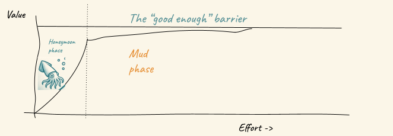

# The Readiness Curve: Why Your LLM Demo Is Not Even the Beginning

We built the initial demo for mywhatif.org in just one night. One night! The concept was simple: users could explore hypothetical stories through AI-powered requests.
 The demo worked well, it could narrate, generate, create cool images. The AI responses were ok'ish, and everyone who saw the demo was convinced we had something special.

Then we tried to make it actually work.
What followed was months of grinding through what we now call the plateau of despair. The AI that seemed so intelligent in controlled demos started producing inconsistent responses with real user inputs. Edge cases multiplied like rabbits. The costs spiraled as we realized the powerful models we used for the demo would bankrupt us at scale. Performance tanked under real traffic. The "simple" integrations became complex challenges.

That one nighter demo became six months of painful iterations just to get something that wouldn't embarrass us in front of real users.

If this sounds familiar, you're not alone. Building an AI-powered application has never been easier. Tools like [Lovable](https://lovable.dev/), [Bolt](https://bolt.new) and [Base44](https://base44.com) let you create impressive demos in minutes—complete web apps, intelligent chatbots, and content generators that seem production-ready from day one.

But here's the brutal truth: that amazing demo is just a teaser for the beginning of the real work.

## The Two-Stage Journey to Hell

While there are probably more stages in the LLM development lifecycle, Let's focus on the two that matter most—the ones that will make or break your project:

**Stage 1: The Honeymoon Phase**
Look at that beautiful steep curve on the left. Rapid, exponential progress. Everything works. You're a genius. Morals are high. The future is bright and there is going to be peace in the middle east soon. You're riding high on the initial success, convinced you'll reach the "good enough" barrier in no time.

**Stage 2: The Mud Phase**
Then reality hits. The curve flattens dramatically. You're stuck in the mud—that long, painful plateau where every incremental improvement requires exponentially more effort. You're still moving toward that "good enough" threshold, but progress slows to a crawl. Nothing works reliably. You question your life choices. The future looks bleak.

Notice how the honeymoon phase gets you maybe 10-20% of the way to production-ready, but takes only 10% of the total effort. The mud phase is where you'll spend 90% of your time grinding through the remaining 70-80% of the work to cross that "good enough" barrier.

## The Illusion of Instant Success

The current wave of LLM development tools creates a seductive illusion. In mere minutes, you can:

- Generate complete web applications with natural language prompts
- Create chatbots that handle complex conversations
- Build content systems that produce human-quality text
- Develop classification systems with impressive accuracy

The demo dazzles. The proof of concept convinces stakeholders. The initial results look promising. 
The sense of trust in what you can achieve in a week is skewed and then... reality hits like a freight train.

## Why the Plateau Is Pure Agony

**Inconsistency at Scale**
Your carefully curated test cases don't represent the chaos of real user data. What works in development fails unpredictably in production. Every day brings new, creative ways for your system to break.

**The Evaluation Problem**
Here's the real nightmare: we don't know what we're really measuring. How do you evaluate whether an LLM response is "good"? Traditional metrics don't work. Human evaluation is expensive and inconsistent. Automated evaluation is unreliable. You're trying to optimize a system when you can't even define what success looks like.

**Context Sensitivity Hell**
A prompt that works perfectly in testing might fail when the context shifts slightly. Different user inputs, varying data formats, subtle changes in conversation flow—any of these can cause your carefully crafted system to produce garbage.

**The Cost Reality Check**
The powerful models that make development easy are financial death sentences at production scale. You're forced to optimize for smaller, cheaper models that perform worse, starting the painful optimization cycle all over again.

## The "Mud" Period: Where Dreams Go to Die

After the initial excitement wears off, you enter what we call the "mud period." You're moving, but barely. Every step forward feels like you're sinking deeper. The path forward becomes unclear. The team grows exhausted and confused about where they started and where they're going.

This is where you realize you need to try different models—maybe fine-tune your own, experiment with reinforcement learning policies, explore smaller language models (SLMs), dive into GRPO (Generalized Reward Policy Optimization) to train better models. You frantically try to catch up on the latest LLM research, which has already changed since this morning (only half-joking).

This is the most dangerous phase—where promising projects get abandoned and AI initiatives fail. It's where the excitement turns to dread, where "this will be easy" becomes "what have we gotten ourselves into?"

## The Last Mile Torture

**Reliability Engineering**
How do you monitor performance when outputs are inherently variable? Traditional metrics like uptime and error rates don't capture the nuanced ways LLMs fail. You're flying blind while everything burns around you.

**Quality Assurance Hell**
Testing LLM applications requires fundamentally different approaches. You can't write unit tests that check for exact outputs. You need evaluation frameworks that assess semantic correctness—complex, expensive, and never quite right.

**Production Optimization**
The model that works in development is too slow or costly for production. Optimization requires understanding subtle trade-offs between model size, speed, cost, and quality. Every optimization breaks something else.

**Regulatory Compliance**
As LLM applications enter regulated industries, they face scrutiny that rapid prototyping tools aren't designed to handle. Explainability, bias detection, and compliance become insurmountable hurdles.

## Breaking Through: What We're Building with Rewyr
Rewyr is our response to the painful gap between LLM demos and real-world deployment.

It’s a system design tool for teams serious about production-grade AI—built to surface failure points, guide optimization, and accelerate the path through the plateau.

We’re still building it. But if you're wrestling with the same challenges, we want to hear from you.

→ [Get early access / Join the waitlist](/contact)

## Surviving the Plateau

The readiness curve isn't inevitable, but it's brutal. With the right approach, you can accelerate through the plateau:

**Rule #1: Abandon the Prototype Mindset**
The plateau phase isn't about creative tinkering. It requires systematic engineering discipline. Keep your eyes on the ball—even as that ball keeps moving and multiplying.

**Systematic Analysis**
Don't optimize based on intuition. Analyze your LLM usage patterns systematically. Understand your components, their performance, and their interdependencies.

**Data-Driven Optimization**
Use real production data to guide decisions, not limited test cases or gut feelings.

**Production-First Mindset**
Design with production requirements from the beginning, not as an afterthought.

## The Brutal Truth

The question isn't whether you can build an LLM application quickly—you can. The question is whether you can survive the plateau long enough to build one that actually works.

The readiness curve is real, painful, and will test your resolve. But the organizations that successfully navigate this curve will have a significant competitive advantage in the AI-powered future.

The last mile is the most difficult, but it's also where the real value lies. The tools that make it easy to get started aren't the tools that will get you to production.

Are you ready to leave the honeymoon phase and enter the plateau of despair?